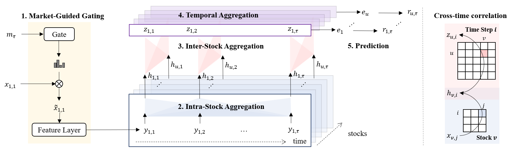
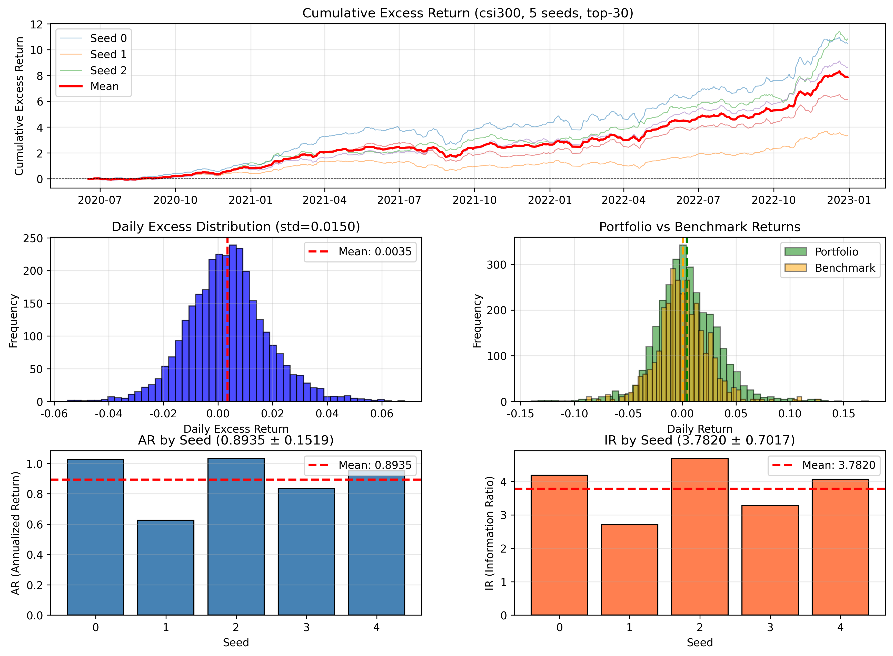
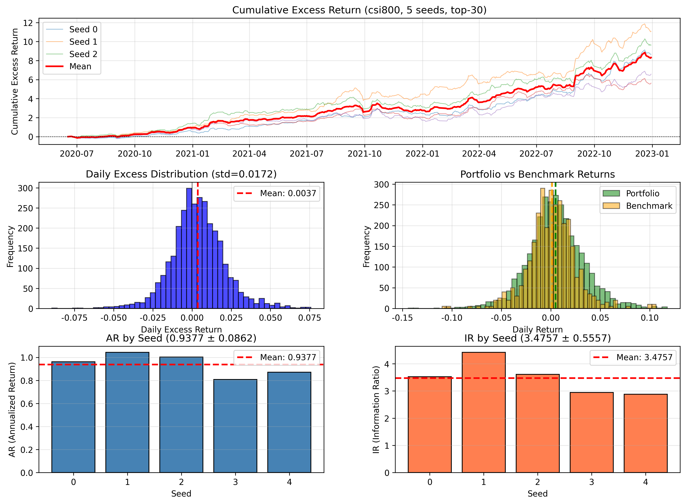
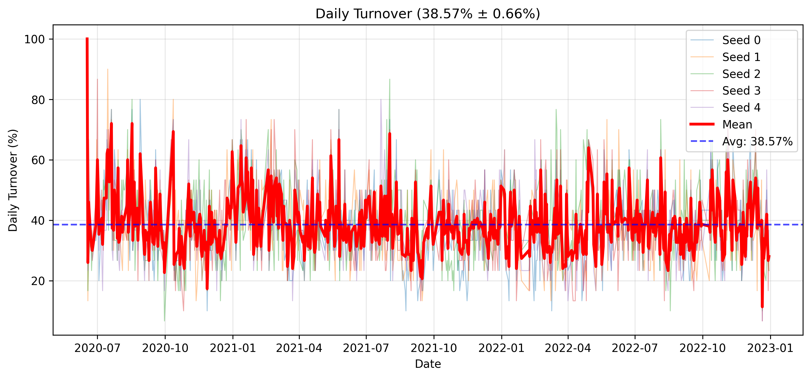
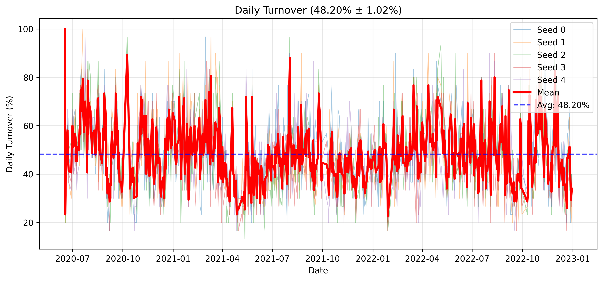

[](https://doi.org/10.5281/zenodo.15480922)

# MASTER — reproduction

This repository is an **independent reproduction** of the AAAI 2024 paper **MASTER: Market-Guided Stock Transformer for Stock Price Forecasting**. It is based on the authors’ public code and materials (see Zenodo badge above and the [original repository](https://doi.org/10.5281/zenodo.15480922) linked from the paper). [[Paper]](https://ojs.aaai.org/index.php/AAAI/article/view/27767) · [[arXiv]](https://arxiv.org/abs/2312.15235)

MASTER is a stock transformer for price forecasting: it models momentary and cross-time stock correlation and guides feature selection with market information.

For comparison with MASTER, this repository also implements **seven baseline models**: **LSTM**, **TCN**, **XGBoost**, **Transformer**, **GAT**, **DTML**, and **GRU**.



---

## Usage

1. **Dependencies**  
   - `pandas == 1.5.3`  
   - `torch == 1.11.0`

2. **Qlib** — minimal dependency; install with:
   ```text
   pip install pyqlib
   ```
   See [Qlib](https://github.com/microsoft/qlib).

3. **Data** — download the dataset and unpack it under `data/` (layout expected by this code).

4. Run `main.py`. Depending on which universe you train on, adjust the relevant lines in `base_model.py` → `SequenceModel.train_epoch`.

5. Example checkpoints (including opensource-trained weights) may live under `model/` (e.g. `model/csi300_opensource_0.pkl`, `model/csi800_opensource_0.pkl`); names may differ in your checkout.

---

## Data

We use **open-source market data** from [chenditc/investment_data releases](https://github.com/chenditc/investment_data/releases), processed in the Qlib-style pipeline consistent with the upstream MASTER release. Place the prepared train/validation/test files under `data/` as required by the training script.

**Tensor layout** (data loader): shape `(N, T, F)` — `N` stocks per prediction date (~300 for CSI300, ~800 for CSI800), `T = 8` (lookback), `F = 222` (factors, market features, and label). Market reference columns are summarized in `data/csi_market_information.csv` in setups that include it.

---

## Results

We run **backtesting on both the CSI300 and CSI800 universes**. We evaluate multiple random seeds (e.g., seed 0-4), which change stochastic training factors like initialization and data order, to check result robustness across runs. Below, each figure is shown as a **pair**: **CSI300 on the left**, **CSI800 on the right** (use the same layout when generating new plots).

<p align="center">
  
  
</p>


<p align="center">
  
  
</p>

---

## Citation

If you use the original method, data recipe, or released artifacts, cite the paper:

```bibtex
@inproceedings{li2024master,
  title={Master: Market-guided stock transformer for stock price forecasting},
  author={Li, Tong and Liu, Zhaoyang and Shen, Yanyan and Wang, Xue and Chen, Haokun and Huang, Sen},
  booktitle={Proceedings of the AAAI Conference on Artificial Intelligence},
  volume={38},
  number={1},
  pages={162--170},
  year={2024}
}
```

When referring to this replication fork, cite the original work and state that your results were obtained with this reproduction codebase.
